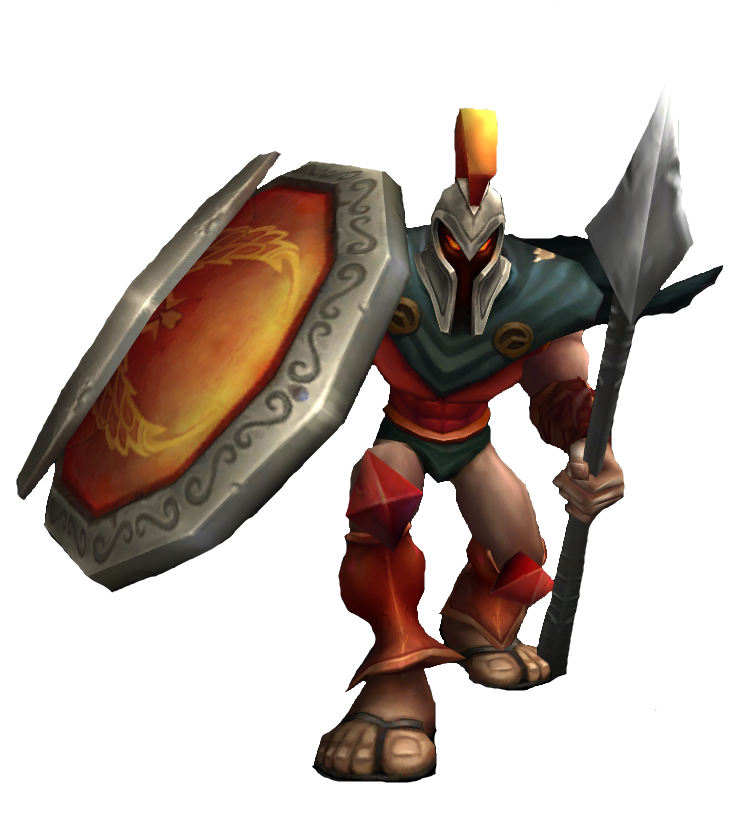

# 배경

"진정한 전사를 데려오든지, 네놈 같은 자들을 백 명은 더 데려와라. 세상 마지막까지 전설로 남을 전투를 벌여보자."

천하제일의 전사 판테온은 거의 누구도 막을 수 없는 전투의 화신이다. 타곤 산 지역에서 살아가는 호전적인 부족 라코어 출신인 그는 위험천만한 타곤 산봉우리에 오름으로써 전쟁의 성위에게 선택받아 그 현신이 되었다. 언제나 쉬지 않고 타곤 산의 적을 쫓는 판테온의 강함은 인간을 아득히 초월해, 가는 곳마다 남는 것은 시체뿐이다.
-
